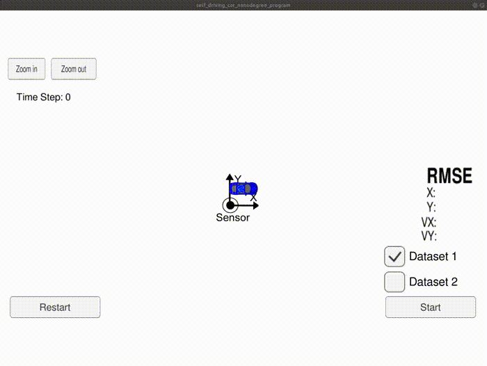

# Unscented Kalman Filter

## Introduction
This project implements the Unscented Kalman Filter (UKF) algorithm which is utilized to fuse different sensor information (radar and lidar).

## Examples
Here is an example. In this example the UKF is used to track the motion state of a bicycle that is moving around the blue car.

